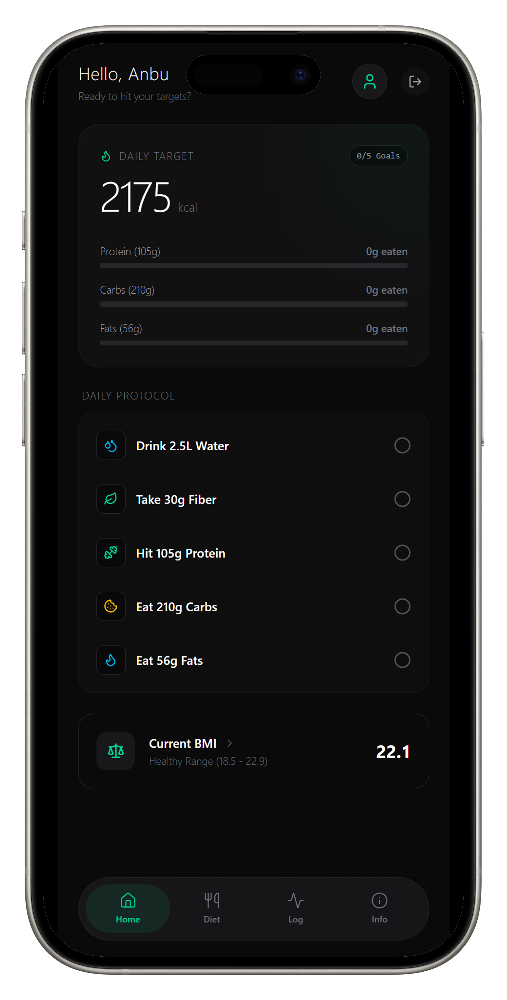

# உடல் (Udal) - The Regional Fat Loss & BMI Blueprint

[](https://github.com/anburocky3/udal-workout-app)
[](https://github.com/anburocky3/udal-workout-app)
[](https://github.com/anburocky3/udal-workout-app)

[](https://discord.gg/6ktMR65YMy)
[](https://www.youtube.com/c/cyberdudenetworks)

**Udal** is a minimalist, mobile-first Web Application and PWA designed to demystify fat loss through strict thermodynamics and hyper-local dietary habits. Built specifically with South Asian genetics and Tamil Nadu regional cuisines in mind, it generates precise calorie deficits, macro splits, and tracks your weekly progression.

## Screenshots



## ✨ Core Features

- **🧬 Scientific Formula Engine:**
  - Calculates Maintenance (TDEE) and exact Calorie Deficits based on personalized weekly weight loss goals.
  - Applies the Atwater General Factor System to accurately calculate caloric yields (Protein/Carb = 4 kcal/g, Fat = 9 kcal/g).
- **⚖️ Asian/Indian BMI Standards:**
  - Custom thresholds optimized for South Asian genetics where the healthy BMI range is strictly capped at 22.9 to account for regional visceral fat predispositions.
- **🍛 Tamil Nadu Diet Integration:**
  - Pre-calculated South Indian meal protocols (e.g., Kuthiraivali, Seeraga Samba Mutton, Neer Mor).
  - Promotes the 50-25-25 macro plate ratio customized for local ingredients.
- **✅ Gamified Daily Checklist:**
  - Interactive daily goals for water, fiber, and macronutrients that visually fill UI progress bars to keep users accountable.
- **📈 Weekly Progress Tracking:**
  - Secure, cloud-backed logging for weight, chest, and waist measurements.
  - Smooth, interactive data visualization using Recharts.
- **📱 Progressive Web App (PWA):**
  - Installable native-app feel with full-screen mobile layouts, strict max-width rendering, and bottom navigation.
- **🛡️ Secure Authentication:**
  - Email/Password authentication with Row Level Security (RLS) ensuring absolute data privacy.

---

## 🛠️ Tech Stack

- **Framework:** [Next.js](https://nextjs.org/) (App Router, TypeScript)
- **Styling:** [Tailwind CSS v4.3](https://tailwindcss.com/)
- **Backend & Database:** [Supabase](https://supabase.com/) (PostgreSQL, Auth)
- **Icons:** [Lucide React](https://lucide.dev/)
- **Charts:** [Recharts](https://recharts.org/)

---

## 🚀 Getting Started

### 1. Git [fork](https://github.com/anburocky3/udal-workout-app/fork)/clone the repository

```bash
git clone https://github.com/anburocky3/udal-workout-app.git
cd udal-workout-app
```

### 2. Install dependencies

```bash
npm install

```

### 3. Setup Supabase Environment Variables

Create a `.env.local` file in the root directory and add your Supabase credentials:

```env
NEXT_PUBLIC_SUPABASE_URL=
NEXT_PUBLIC_SUPABASE_PUBLISHABLE_KEY=
```

### 4. Database Setup

Ensure you have the Supabase CLI installed, then push the database schema to your project:

```bash
npx supabase login
npx supabase link --project-ref your-project-ref-id
npx supabase db push

```

### 5. Run the development server

```bash
npm run dev

```

Open [http://localhost:3000](http://localhost:3000) in your browser to view the application.

---

## 🗺️ Roadmap / Upcoming Features

- [ ] **Offline Mode Sync:** Complete Serwist service worker integration to allow logging measurements while offline.
- [ ] **1-on-1 Challenge Duels:** Add social features allowing users to challenge a friend to a percentage-based weight loss duel over 4, 8, or 12 weeks.
- [ ] **Photo Transformation Tracker:** Side-by-side ghost-overlay photo comparisons.

---

## 📄 License

This project is licensed under the MIT License - see the [LICENSE](/LICENSE) file for details.

---

## 👨‍💻 Author

**Anbuselvan Annamalai (Anbu)**

Head of Product Development @ **CyberDude Networks Private Limited**

_Building software architectures since December 2016._
